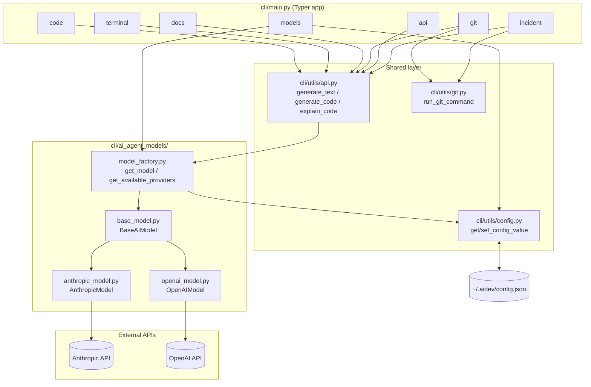
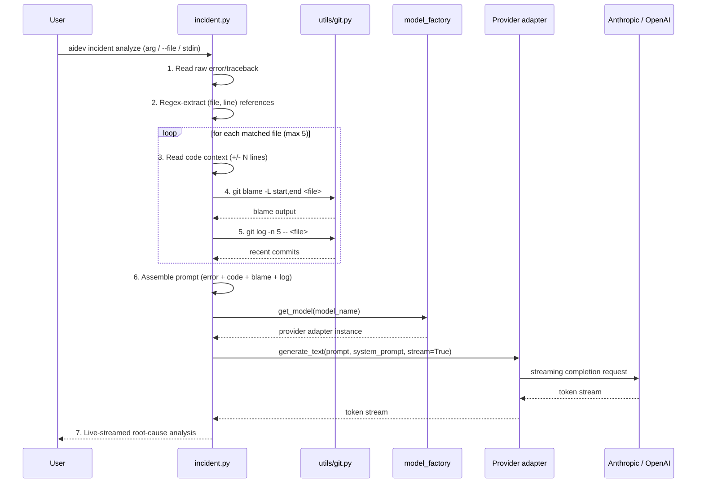
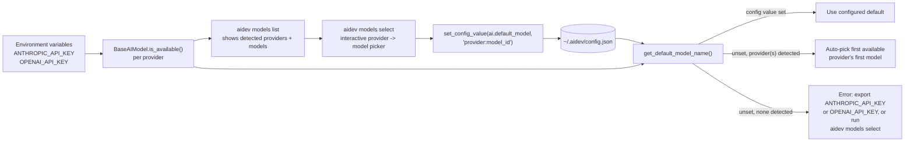

# Architecture

System-level view of the pivot described in [`docs/adr/`](adr/README.md): a CLI that detects
which cloud AI provider the user already has credentials for, and uses it to power an
incident/debugging co-pilot grounded in the local repo's code and git history.

## Component diagram

Command groups all funnel through the same shared layer down to a provider adapter, so every
command benefits from provider detection and model selection without reimplementing it.
`incident` and `git` additionally share git plumbing.

## Sequence diagram: `aidev incident analyze`

The flagship flow. The key property is that steps 3-5 run entirely locally, before anything is
sent to the model — the AI call in step 7 is grounded in real repo state, not just the raw error
text.

## Credential and config flow

Provider detection is a pure environment check (no network call); model selection is
explicit and persisted, with a safe auto-pick fallback so the tool is still usable before the
user has ever run `aidev models select`.

## Notes

- Every component in these diagrams is backed by a decision in an ADR — see
  [`docs/adr/README.md`](adr/README.md) for the rationale behind each one.
- This document describes the target architecture agreed in planning; it does not imply any of
  it has been implemented yet. Check `cli/` for current state.
